# LAUNCH AN EC2 INSTANCE THAT WILL SERVE AS “WEB SERVER”.

### Step 1 — Prepare a Web Server

1. Launch an EC2 instance(using redhat OS) that will serve as "Web Server". Create 3 volumes in the same AZ as your Web Server EC2, each of 10 GiB

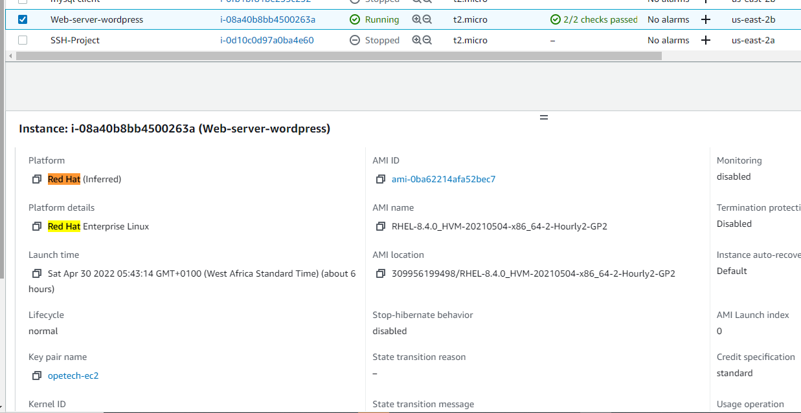

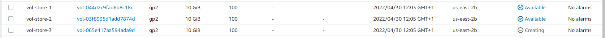

2. Attach all three volumes one by one to your Web Server EC2 instance

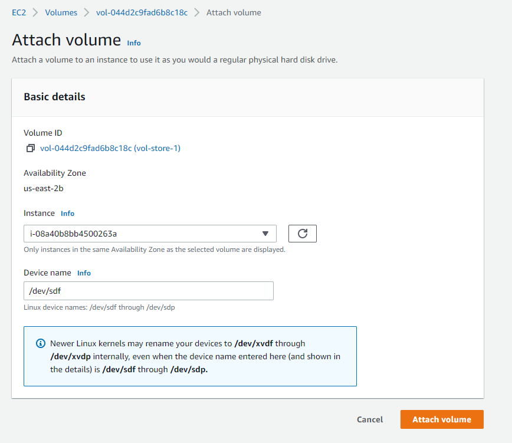

3. Open up the Linux terminal to begin configuration

4. Use lsblk command to inspect what block devices are attached to the server. Notice names of your newly created devices. All devices in Linux reside in /dev/ directory. Inspect it with ls /dev/ and make sure you see all 3 newly created block devices there – their names will likely be xvdf, xvdh, xvdg.

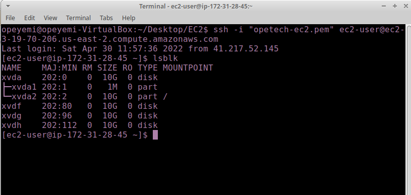

5. Use df -h command to see all mounts and free space on your server

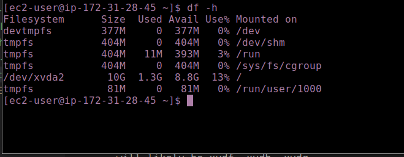

6. Use gdisk utility to create a single partition on each of the 3 disks

run `sudo gdisk /dev/{volume-name}`

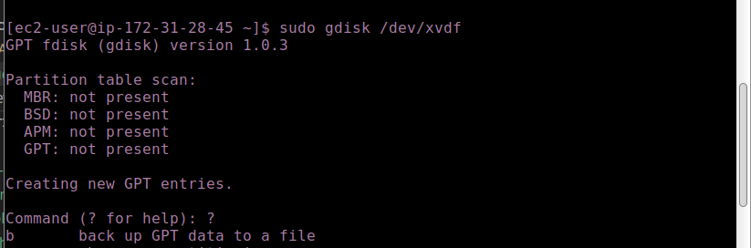

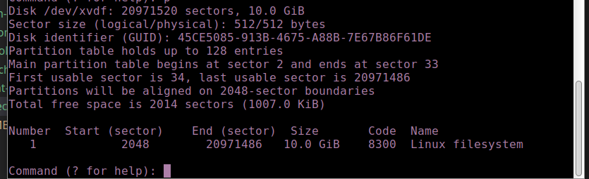

7. Use lsblk utility to view the newly configured partition on each of the 3 disks.

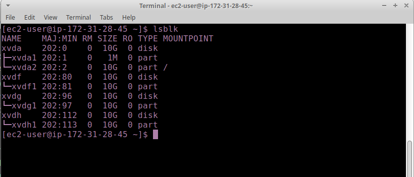

8. Install lvm2 package using `sudo yum install lvm2`. Run `sudo lvmdiskscan` command to check for available partitions.

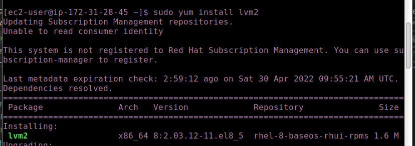

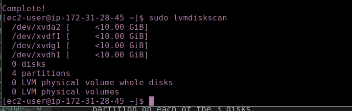

9. Use pvcreate utility to mark each of 3 disks as physical volumes (PVs) to be used by LVM

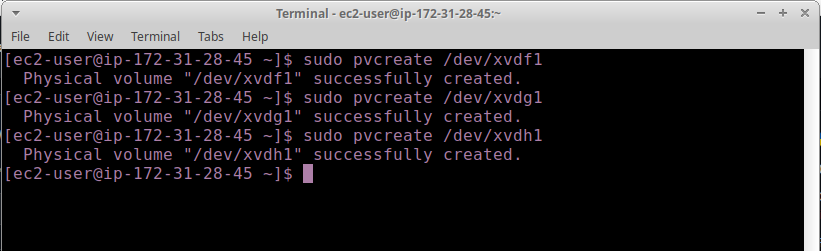

10. Verify that your Physical volume has been created successfully by running `sudo pvs`

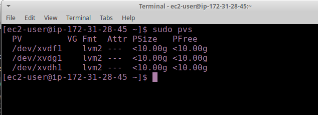

11. Use `vgcreate` utility to add all 3 PVs to a volume group (VG). Name the VG webdata-vg

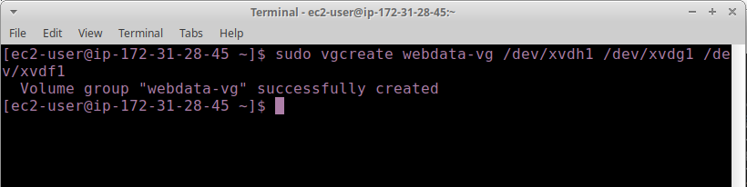

12. Verify that your VG has been created successfully by running `sudo vgs`

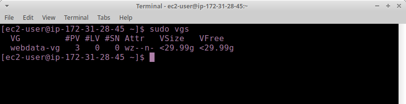

13. Use `lvcreate` utility to create 2 logical volumes. apps-lv (Use half of the PV size), and logs-lv Use the remaining space of the PV size. NOTE: apps-lv will be used to store data for the Website while, logs-lv will be used to store data for logs.

`sudo lvcreate -n apps-lv -L 14G webdata-vg`
`sudo lvcreate -n logs-lv -L 14G webdata-vg`

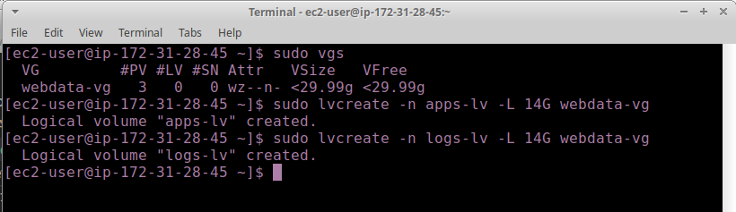

14. Verify that your Logical Volume has been created successfully by running `sudo lvs`

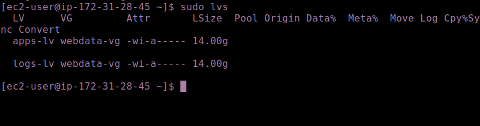

15. Verify the entire setup

`sudo vgdisplay -v #view complete setup - VG, PV, and LV`
`sudo lsblk `

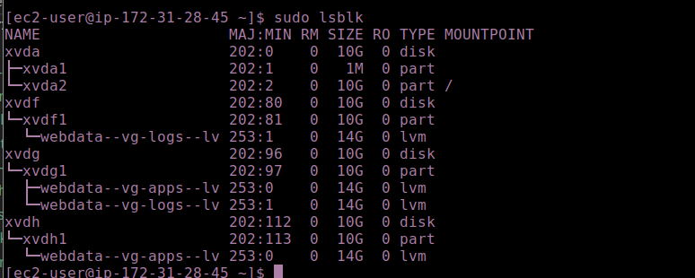

16. Use `mkfs.ext4` to format the logical volumes with ext4 filesystem

`sudo mkfs -t ext4 /dev/webdata-vg/apps-lv`
`sudo mkfs -t ext4 /dev/webdata-vg/logs-lv`

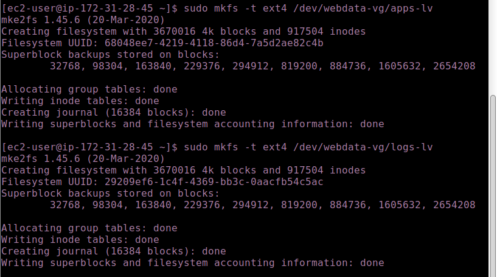

17. Create /var/www/html directory to store website files
`sudo mkdir -p /var/www/html`

18. Create /home/recovery/logs to store backup of log data
`sudo mkdir -p /home/recovery/logs`

19. Mount /var/www/html on apps-lv logical volume
`sudo mount /dev/webdata-vg/apps-lv /var/www/html/`

20. Use `rsync` utility to backup all the files in the log directory /var/log into /home/recovery/logs (This is required before mounting the file system)

`sudo rsync -av /var/log/. /home/recovery/logs/`

21. Mount /var/log on logs-lv logical volume. (Note that all the existing data on /var/log will be deleted. That is why step 15 above is very
important)

`sudo mount /dev/webdata-vg/logs-lv /var/log`

22. Restore log files back into /var/log directory
`sudo rsync -av /home/recovery/logs/. /var/log`

23. Update /etc/fstab file so that the mount configuration will persist after restart of the server.

