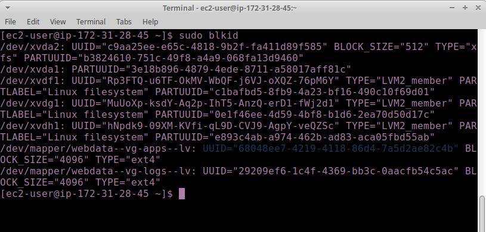
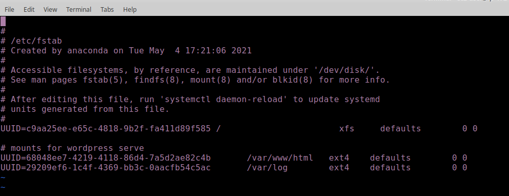
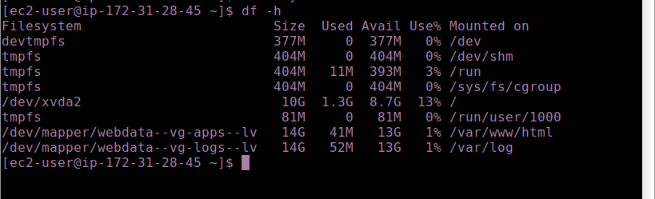
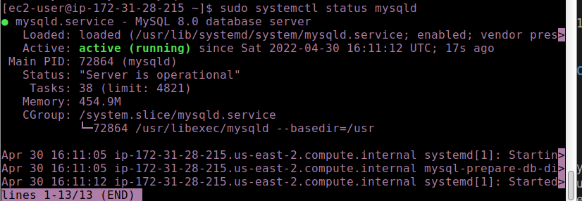
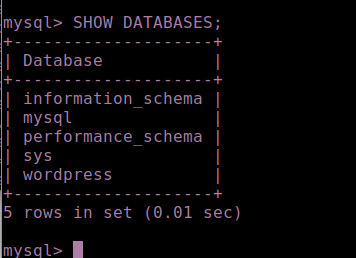
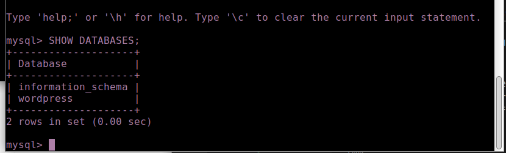
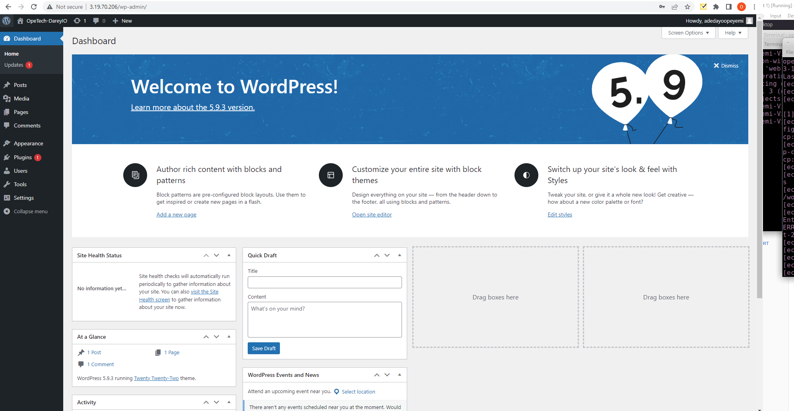

## UPDATE THE `/ETC/FSTAB` FILE

1. The UUID of the device will be used to update the /etc/fstab file;
run `sudo blkid` to view the UUIDs



2. Edit the /etc/fstab with the UUIDs/ run `sudo vi /etc/fstab` to edit



3. Test the configuration and reload the daemon

`sudo mount -a`
`sudo systemctl daemon-reload`

4. Verify your setup by running df -h, output must look like this:




### Step 2 - Prepare the Database Server

### Step 3 - Install WordPress on your Web Server EC2

1. Update the repository
`sudo yum -y update`

2. Install wget, Apache and it’s dependencies
`sudo yum -y install wget httpd php php-mysqlnd php-fpm php-json`

3. Start Apache
`sudo systemctl enable httpd`
`sudo systemctl start httpd`

4.To install PHP and it’s depemdencies
`sudo yum install https://dl.fedoraproject.org/pub/epel/`
`epel-release-latest-8.noarch.rpm`
`sudo yum install yum-utils http://rpms.remirepo.net/`
`enterprise/remi-release-8.rpm`
`sudo yum module list php`
`sudo yum module reset php`
`sudo yum module enable php:remi-7.4`
`sudo yum install php php-opcache php-gd php-curl` `php-mysqlnd`
`sudo systemctl start php-fpm`
`sudo systemctl enable php-fpm`
`setsebool -P httpd_execmem` 

5. Restart Apache
`sudo systemctl restart httpd`

6. Download wordpress and copy wordpress to var/www/html
`mkdir wordpress`
`cd   wordpress`
`sudo wget http://wordpress.org/latest.tar.gz`
`sudo tar xzvf latest.tar.gz`
`sudo rm -rf latest.tar.gz`
`cp wordpress/wp-config-sample.php wordpress/wp-config.php`
`cp -R wordpress /var/www/h`

7. Configure SELinux Policies
  sudo chown -R apache:apache /var/www/html/wordpress
  sudo chcon -t httpd_sys_rw_content_t /var/www/html/wordpress -R
  sudo setsebool -P httpd_can_network_connect=1


### Step 4 — Install MySQL on your DB Server EC2

1. update packages by running
`sudo yum update`
`sudo yum install mysql-server`

2. Verify that the service is up and running by using `sudo systemctl status mysqld`, if it is not running, restart the service and enable it so it will be running even after reboot:

`sudo systemctl restart mysqld`
`sudo systemctl enable mysqld`




### Step 5 — Configure DB to work with WordPress

1. run the following commands
`sudo mysql`

```sql
CREATE DATABASE wordpress;
CREATE USER `myuser`@`<Web-Server-Private-IP-Address>` IDENTIFIED BY 'mypass';
GRANT ALL ON wordpress.* TO 'myuser'@'<Web-Server-Private-IP-Address>';
FLUSH PRIVILEGES;
SHOW DATABASES;
exit
```


### Step 6 — Configure WordPress to connect to remote database.

- Hint: Do not forget to open MySQL port 3306 on DB Server EC2. For extra security, you shall allow access to the DB server ONLY from your Web Server’s IP address, so in the Inbound Rule configuration specify source as /32


1. Install MySQL client and test that you can connect from your Web Server to your DB server by using mysql-client

`sudo yum install mysql`

2. Verify if you can successfully execute `SHOW DATABASES;` command and see a list of existing databases



3. Change permissions and configuration so Apache could use WordPress:

4. Enable TCP port 80 in Inbound Rules configuration for your Web Server EC2 (enable from everywhere 0.0.0.0/0 or from your workstation’s IP)

5. Try to access from your browser the link to your WordPress `http://<Web-Server-Public-IP-Address>/wordpress/`

